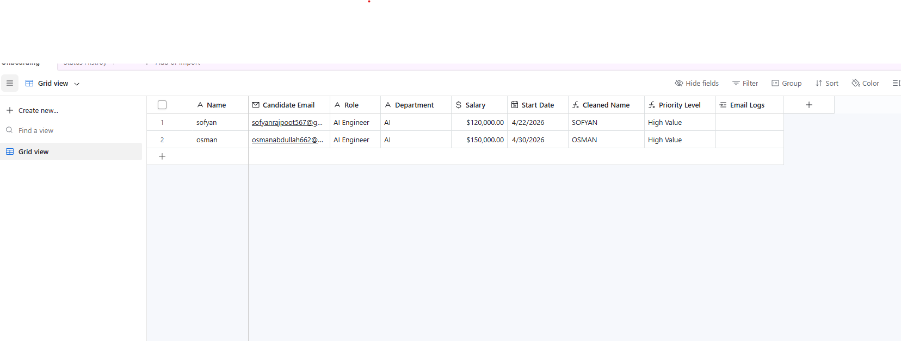
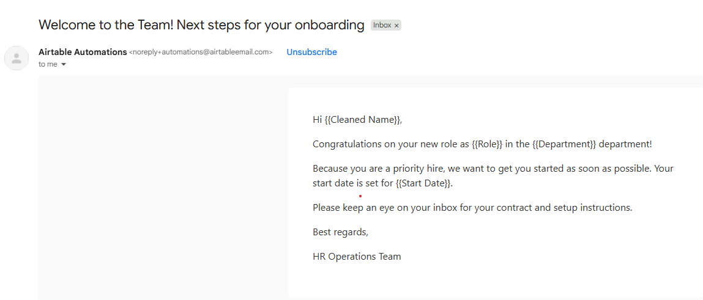
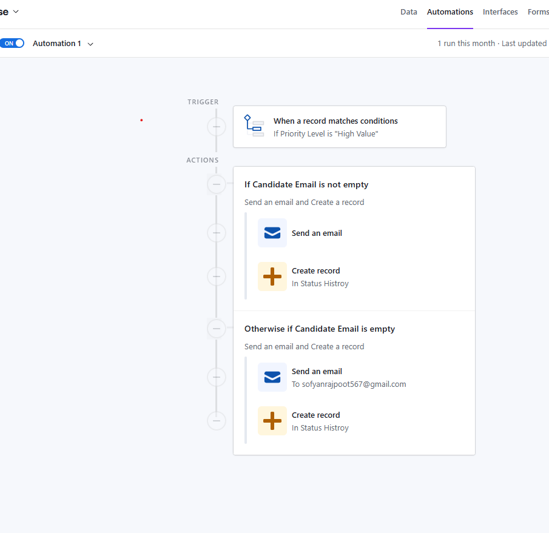

# Candidate Submission Template

## Candidate Information
- Full Name: Mohammad Sofyan Abdullah
- Email: [sofyanrajpoot567@gmail.com]
- LinkedIn or Portfolio: https://mohammadsofyan-portfolio.vercel.app/
- Submission Date: 25/4/2026

## Task 1: Intermediate Airtable Skills

### 1. Full Name Formula
Provide the formula used to concatenate the First Name and Last Name fields.

### 2. Cleaned Email Formula
Provide the formula used to clean the Email Input.

### 3. Status Categorization Formula
Provide the formula logic for categorizing the new hires.

### 4. Days Since Created Formula
Provide the formula logic for calculating days since the new hire record was created.

## Task 2: Advanced Airtable Automation

### 1. Automation Steps
My approach involved separating concerns by creating two distinct tables:
1. **User Data Table**: Stores the candidate's primary information.
2. **Mail Log Table**: A dedicated tracking table used to record whether the onboarding email was successfully sent to the user.
The automation is configured to trigger when necessary, dispatch the required emails (e.g., via Gmail), and reliably track the success/failure state of that communication in the Mail Log table.

### 2. Interface Design
Below are the screenshots of the interface and setup:

**User Data Table:**

**Mail Log / Gmail Integration:**

**Automation Setup:**

### 3. Formula Logic
The primary logic relies on standard Airtable relationships between the User Data and Mail Log tables to ensure each email action is directly tied to the correct candidate record without requiring overly complex standalone formulas.

### 4. Assumptions
- Creating a separate table for the mail log makes it easier to scale (e.g., if multiple emails or different types of communication need to be sent and tracked) rather than cluttering the user data table with multiple status fields.

### 5. Optional Notes
The attached screenshots (`Data_User.png`, `Gmail.png`, and `Paramount_Automation.png`) show the step-by-step implementation of the automation and tracking system.
